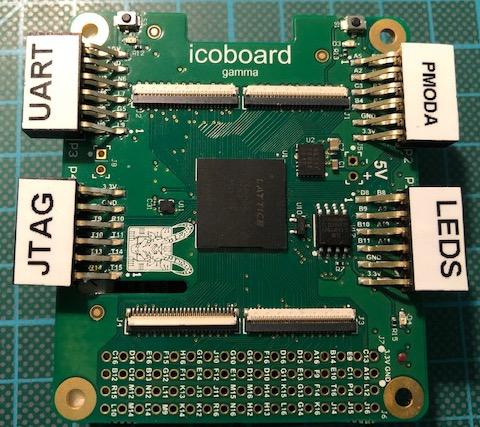
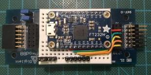
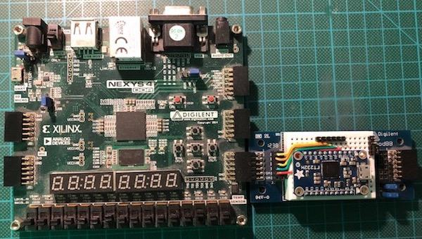

# J1Sc - A simple reimplementation of the [J1 CPU](http://www.excamera.com/sphinx/fpga-j1.html) in Scala using Spinal HDL

## How to build J1Sc and Swapforth

To build the J1Sc, you need first to create the VDHL / Verilog sources. The implementation is written by using *Spinal HDL* (https://github.com/SpinalHDL/SpinalHDL). Hence these sources are generated by a Scala program (Spinal HDL is a compelling Scala library that can be used to generate VHDL and Verilog code.

* Install OpenJDK 8

* Install a running Scala system and sbt

* Clone the latest version of Spinal HDL (at least version 1.4.1)
   (see https://github.com/SpinalHDL/SpinalHDL)

* Setup Spinal HDL
   (see http://spinalhdl.github.io/SpinalDoc/spinal_getting_started/)

* Install gforth (e.g. `sudo apt-get install gforth`)

* Change directory to the new clone of SpinalHDL and run `sbt publish-local` inside

* Clone J1Sc (use `git clone --recurse-submodules https://github.com/SteffenReith/J1Sc.git`)

* Change directory to J1Sc

* Run `cd toolchain/forth && make && cd ../..` to build the forth core system

* Build, load and install the tty0tty kernel module 

## A FORTH Shell/Terminal for J1Sc
Manfred Mahlow offers an excellent terminal for embedded FORTH systems, which supports linux on x86 and Raspberry/Raspbian. Besides 430CamelForth , 430eForth , 4e4th, AmForth, anyForth , Mecrisp , Mecrisp-Stellaris , noForth and STM8 eForth it also supports the J1Sc with Swapforth now (thank you Manfred!). This solution gives a much higher comfort than the original Python-based terminals from Swapforth. Hence, it is (strongly) suggested to use e4thcom instead the provided python-scripts. The python scripts are not very comfortable (you have been warned!) and reconnecting to your J1Sc doesn't work (at least for me).

Download the latest e4thcom (https://wiki.forth-ev.de/doku.php/en:projects:e4thcom) and install it according to the documentation (copy it to the installation directory) the e4thcom-plugin swapforth-j1sc.efc from support/e4thcom/. Version 0.8.2 works out of the box, because it has the swapforth-plugin in the distribution. Therefore, you don't have to copy swapforth-j1sc.efc!

Start enjoying e4thcom by the following command-line by `e4thcom -d ttyUSB1 -b B115200 -t swapforth-j1sc`. In case anything does not work, please check for the correct transmission rate (B115200 for the Nexys4 and B38400 for the simulation) and the serial device (e.g. `/dev/tnt0` for the simulation). Make sure that the PATH-variable is set correctly and your J1Sc instance is connected to `/dev/ttyUSB1` or modify the command-line accordingly to your situation.

The descriptions below show how to work with J1Sc _without_ e4thcom. I give you advise _not_ to do so because the shell scripts `bin/confsX` are unflexible and uncomfortable. Be warned!

## Supported prototyping boards
### J1Sc for a Digilent Nexys4 and Nexys4DDR board

* We will build the J1Sc variant J1Nexys4X (either using the VHDL or the Verilog version) by `sbt run` (select the Nexys4X configuration to be generated). The generated files can be found in `gen/src/vhdl/J1Nexys4X.vhd` and `gen/src/verilog/J1Nexys4X.v`. You need `Board_<BOARDNAME>.vhd` and `PLL.vhd` in `src/main/vhdl/arch` or the corresponding Verilog versions in `src/main/verilog/arch` as toplevel for synthesis.
A Xilinx Vivado project file `J1Sc.xpr` for the VHDL version can be found in `vprj/vhdl/J1Sc` and the Verilog version is in `vprj/verilog/J1Sc`. Note that J1Sc runs fine with a 100Mhz clock on a Nexys4 DDR from Digilent. Constraint files for the Nexys4 DDR can be found in `/src/main/xilinx/nexys4ddr` the corresponding files for the Nexys4 can be found in `/src/main/xilinx/nexys4`.

* Next build J1Nexys4X (see `gen/src/vhdl` or `gen/src/verilog`) which is the J1Sc variant used fo Neys4X boards. Send the .bit file to your FPGA/board (use either `src/main/vhdl/arch/Nexys4DDR/BoardNexys4DDR.vhd` or `src/main/verilog/arch/Nexys4DDR/BoardNexys4DDR.v` as toplevel module)

* `cd toolchain/forth`

* Become root or set the permissions of your serial devices properly and run `bin/confsX`, where X is the number of the used serial port. Hence X is 0 if `/dev/ttyUSB0` should be used.

* Press the reset button (default is the "CPU reset" button on the Nexys4 DDR). You should see something like: `Contacting... established` `Loaded 142 words`

* Type `#include swapforth.fs` to load the complete FORTH system

* Turn the leds on by `$ffff leds!`

* Use the first RBG led by `5 10 10 rgbled!`

* Have fun with a working FORTH system

## J1Sc for the icoBoard

At the moment only one hardware configuration is supported

- icoBoard Version 1.1
- icoUSBaseboard: FTDI Interfacebasis (first FTDI interface for programming the FPGA)
- Pmod USBUART (second FTDI interface for serial connection)
- Pmod 8LD (simply eight leds)

Attach the [icoUSBBaseBoard](https://shop.trenz-electronic.de/en/TE0889-02-icoUSBaseboard-FTDI-Interfacebasis-fuer-das-icoBoard) to the icoBoard and connect the Pmods as shown [here](https://github.com/SteffenReith/J1Sc/blob/master/doc/misc/J1Sc_AES_IcoBoard.jpg). Hence use PMod P1 for the leds and the *upper row* (!) of PMod P3 for the UART.

Clone and install the latest version of

* yosys (clone https://github.com/cliffordwolf/yosys.git)

* next-pnr (clone https://github.com/YosysHQ/nextpnr.git)

* IceStorm (clone https://github.com/cliffordwolf/icestorm.git)

* IcoTools (clone https://github.com/cliffordwolf/icotools.git)

Now change to the cloned directory of J1Sc

* Build J1Ico by using the sbt build system. Type `sbt icoProg` to generate a Verilog version of J1Sc for your IcoBoard, synthesize it, do a place & route and to download the bit-file finally.

* Become root or set the permissions of your serial devices properly and run `bin/confsX`, where X is the number of the used serial port. Hence X is 0 if `/dev/ttyUSB0` should be used.

* Press the reset button (the button S1 near the PMod P2 is used by default). You should see something like: `Contacting... established` `Loaded 142 words`

* Type `#include swapforth.fs` to load the complete FORTH system

* Turn the leds on by `$ff leds!`

* Have fun with a running FORTH system on your icoBoard!

At the moment, the tools can provide an implementation that is able to run at 40 MHz. This constraint will be checked during the sbt build. Hence stay tuned and read the log-files.

In principle, it is possible to use the IcoBoard together with a Raspberry PI to run J1Sc. In the case you do this, please send me (EMail: streit@streit.cc) the needed steps, because I don´t have/use this configuration.

## J1Sc for the iCEBoard

J1Sc has some preliminary support for the iCEBreaker FPGA board (see https://github.com/icebreaker-fpga). At the moment the UART, buttons, and LEDs can be used but it has not corresponded forth words for easily using them. 

Clone and install the latest version of

* yosys (clone https://github.com/cliffordwolf/yosys.git)

* next-pnr (clone https://github.com/YosysHQ/nextpnr.git)

* IceStorm (clone https://github.com/cliffordwolf/icestorm.git)

* IcoTools (clone https://github.com/cliffordwolf/icotools.git)

Now change to the cloned directory of J1Sc and connect your board by USB

* Build J1Ice by using the sbt build system. Type `sbt iceProg` to generate a Verilog version of J1Sc for your iCEBreaker board, synthesize it, do a place & route and to download the bit-file finally.

* Become root or set the permissions of your serial devices properly and run `bin/confsX`, where X is the number of the used serial port. Hence X is 0 if `/dev/ttyUSB0` should be used.

* Press the reset button (the button S1 near the PMod P2 is used by default). You should see something like: `Contacting... established` `Loaded 142 words`

* Type `#include swapforth.fs` to load the complete FORTH system

* Have fun with a running FORTH system on your iCEBoard!

At the moment, the tools can provide an implementation that can run at 18 MHz. This constraint will be checked during the sbt build. Hence stay tuned and read the log-files.

## A Gatelevel simulation of J1Sc
The latest versions for SpinalHDL (you need at least version 1.1.2) offer a complete gate-level simulation of the generated designs. In the background, SpinalHDL uses Verilator as a simulation framework and hide all the C++ stuff by another Scala library called *SpinalSim*. Moreover, to connect the simulation to the host, a virtual null-modem cable is used. Hence

* Clone and install the latest version of Verilator from http://git.veripool.org/git/verilator

* Clone and install the latest version of tty0tty from https://github.com/SteffenReith/tty0tty.git. Load the kernel module by `insmod tty0tty.ko`. To make the installation permanent, install the kernel module according to your distribution (for Ubuntu 16.04.3 LTS ``cp tty0tty.ko /lib/modules/`uname -r`/kernel/drivers/misc`` and `depmod -a`). Alternatively you can update the tty0tty submodule by `git submodule update --init --recursive`. You can install the kernel-module by running `scripts/installTTY`.
You have to set the permission of `/dev/tnt0` and `/dev/tnt1` such that they are user read- and writeable. You can set the permissions of ´/dev/tnt0´ and ´/dev/tnt1´ by udev after every reboot automatically. For this see the udev-rule `55-tty-tnt.rules` in the directory `doc/udev`, modify it to your needs (e.g. the dialout group) and copy it e.g. to `/etc/udev/rules.d`.

* Go to your cloned J1Sc copy and type `cd toolchain/forth`

* start a terminal by `bin/confhost`

* open another shell window go to your copy of J1Sc and type `sbt test:run` to compile and run the simulation. If everything went well a small gui with some LEDs and a reset button will occur (maybe you have to resize the window).

* Press the reset button. You should see something like: `Contacting... established` `Loaded 142 words` in your terminal window.

* Type `#include swapforth.fs` to load the complete FORTH system

* Turn the simulated LEDs on by `$ff leds!`

* Have fun with a running FORTH on the simulated J1Sc!

## Preliminary JTAG support
J1Sc offeres a simple and very restricted JTAG support at a very early stage. At the moment you can reset, stop and continue the CPU by corresponding JTAG-commands. Moreover, you can upload a memory-dump to the internal RAM. The corresponding scripts can be found in `support/openocd/bin`. All variants of J1Sc (including the gate-level simulation!) support this JTAG interface. Note that you need a special variant of OpenOCD for this. So clone and build

* https://github.com/SteffenReith/openocd_riscv.git

For the physical connection, I use a simple FT232H board from [adafruit](https://www.adafruit.com/product/2264) as shown below (I found it accidentally in my grab bag). Remember any similar FT232H adapter should work (please send [email](mailto:j1sc@streit.cc) if you use another adapter) too.

In `support/openocd/bin` you will find some primitive OpenOCD scripts for programming, resetting, resuming and stalling your J1Sc:

`progJ1`, `resetJ1`, `resumeJ1` and `stallJ1`

For the gatelevel simulation of J1Sc use

`progJ1Sim`, `resetJ1Sim`, `resumeJ1Sim` and `stallJ1Sim`

### Wiring a JTAG-adapter to a Nexys4DDR

|JTAG signal|FT232H pin|Constraint|PMod|
|-----------|----------|----------|----|
|TCK|D0|H16|JB10|
|TDI|D1|G13|JB9|
|TDO|D2|F13|JB8|
|TMS|D3|E16|JB1|

The JTAG-implementation is at a very early state. Hence, I suggest that you don't rely on a correct function! This will be fixed in the future.
Note that the JTAG-support is tested on a Nexys4DDR (and the simulation) only, but in principle, it should work for the IcoBoard and the iCEBreaker too! In the case that you use the JTAG on the IcoBoard or the Icebreaker: Please send an email and the needed patches!
